# MM-PRV-008

# DATOVÝ MODEL PROVIDER REGISTRY A PROVIDER MATRIX

---

## Informace o dokumentu

| Položka | Hodnota |
|---|---|
| Dokument | MM-PRV-008 |
| Document ID | MM-PRV-008 |
| Název dokumentu | Datový model Provider Registry a Provider Matrix |
| Typ dokumentu | PROVIDER_REGISTRY_DATA_MODEL |
| Dokumentační oblast | 05_PROVIDERS |
| Edice | MM-DOC TECH |
| Verze | 0.9 |
| Stav | APPROVED |
| Implementační stav | TARGET DESIGN – NOT YET IMPLEMENTED |
| Původní stav zdrojového dokumentu | NOVÝ DOKUMENT |
| Datum | 2026-07-21 |
| Autor projektu | Petr |
| Technická spolupráce | OpenAI ChatGPT |
| Primární formát | Markdown (`.md`) |
| Cílové umístění | `docs/05_PROVIDERS/` |
| Nahrazuje | — |
| Navazuje na | MM-PRV-001 až MM-PRV-007 |
| Související dokumenty | MM-DOC-100, MM-DOC-200, MM-DOC-300, MM-DOC-800, MM-DB-001, MM-DB-002, MM-DB-003, MM-REF-001, MM-REF-002 |
| Referenční standardy | MM-STD-001, MM-STD-002, MM-STD-003, MM-STD-004, MM-STD-005, MM-STD-006, MM-STD-007, MM-STD-008, MM-STD-009 |
| Cílová databáze | PostgreSQL `matchmatrix` na PC2 |
| Cílové schéma | primárně `ops`, případně řízené rozšíření podle schváleného DB návrhu |
| Cílové uživatelské rozhraní | český panel Provider Matrix v MatchMatrix Řídicím centru |
| Bezpečnostní klasifikace | Bez API klíčů, tokenů, hesel, platebních údajů a tajných smluvních obsahů |

---

# 1. Úvod

Datový model Provider Registry a Provider Matrix převádí referenční katalog `MM-PRV-007` do návrhu databázové evidence, provozních vazeb a českého panelového rozhraní.

Dokument určuje, jak má MatchMatrix dlouhodobě evidovat:

- identitu providerů,
- technické aliasy a adaptéry,
- tarify a limity,
- sportovní, geografické a entitní pokrytí,
- roli providera v routingu,
- integrační připravenost,
- zdravotní a provozní stav,
- právní a licenční stav,
- důkazy, ověření a termíny revalidace,
- incidenty a historii změn,
- odvozenou připravenost pro plánovač a panel.

Provider Registry není pouhý seznam názvů. Má být řízenou databázovou vrstvou, která propojí dokumentační pravidla, skutečné runtime výsledky, provozní rozhodování a lidské schvalování.

## 1.1 Důvod vzniku

Dosavadní providerové informace existují v několika formách:

- provider map tabulkách,
- workerech a konfiguracích,
- runtime auditech,
- plánovači harvestu,
- job runs,
- dokumentaci `MM-PRV-001` až `MM-PRV-007`,
- historických denních zápisech,
- smluvních a tarifních podkladech,
- ručních poznámkách.

Bez jednotného registru vzniká riziko, že stejný provider bude v různých částech systému popsán odlišným kódem, jiným stavem nebo bez informace o platnosti důkazu.

## 1.2 Hlavní výsledek dokumentu

Výsledkem je cílový návrh:

1. relačního datového modelu v PostgreSQL,
2. řízených kódovníků a stavů,
3. vazeb na runtime tabulky a plánovač,
4. odvozených pohledů pro rozhodování,
5. českého panelu Provider Matrix,
6. implementačního a migračního postupu,
7. kontrolních kritérií pro přijetí řešení.

## 1.3 Rozsah a omezení

Dokument je návrhový. Neprohlašuje žádnou navrženou tabulku, pohled, trigger ani panelovou funkci za implementovanou, dokud nebude:

- vytvořena samostatná databázová migrace,
- provedena kontrola dopadu na existující objekty,
- ověřeno skutečné schéma na PC2,
- provedeno testovací naplnění,
- schváleno mapování stávajících providerových kódů,
- dokončeno provozní ověření.

## 1.4 Bezpečnostní hranice

Provider Registry nesmí ukládat:

- API klíče,
- přístupové tokeny,
- hesla,
- celé tajné smlouvy,
- čísla platebních karet,
- bankovní údaje,
- osobní přihlašovací údaje.

Smí evidovat pouze bezpečný odkaz na správu přihlašovacích údajů, například logický název secret profilu nebo interní referenci bez hodnoty tajemství.

## 1.5 Závěr kapitoly

Kapitola vymezila účel, výsledek, rozsah a bezpečnostní hranice návrhu Provider Registry. Přínosem je jednoznačné oddělení cílového modelu od již implementované reality a vytvoření bezpečného základu pro další návrh. Na tuto kapitolu navazuje kapitola 2, která stanovuje cíle, odpovědnosti a hranice systému.

---

# 2. Cíle, odpovědnosti a hranice systému

## 2.1 Cíle Provider Registry

Provider Registry musí umožnit odpovědět alespoň na tyto otázky:

- Jaký je neměnný interní kód providera?
- Jaký je jeho aktuální obchodní název a kdo jej provozuje?
- Pro které sporty, vrstvy, entity, soutěže, země a období je použitelný?
- Jakou roli má v konkrétním routing kontextu?
- Je technicky integrován a naposledy úspěšně ověřen?
- Je jeho tarif aktivní a postačuje pro plánovaný objem?
- Je použití dat právně schváleno, omezeno, v revizi nebo blokováno?
- Jaký je aktuální health stav?
- Jaký důkaz podporuje uvedené tvrzení?
- Kdy musí být údaj znovu ověřen?
- Jaká změna proběhla, kdo ji provedl a proč?

## 2.2 Cíle Provider Matrix

Provider Matrix má být české provozní rozhraní nad registry daty. Musí umožnit:

- rychlý přehled všech providerů,
- filtrování podle sportu, vrstvy, entity, role a stavu,
- zobrazení hlavních blokátorů,
- rozkliknutí detailu providera,
- zobrazení českého významu cizích stavových kódů,
- kontrolované vytváření návrhů změn,
- oddělení návrhu, schválení a aktivace,
- dohledání důkazu a historie,
- předání schválených stavů plánovači a runtime logice.

## 2.3 Co Provider Registry nenahrazuje

Registry nenahrazuje:

- RAW data,
- staging tabulky,
- kanonické sportovní entity,
- provider map tabulky konkrétních entit,
- job runs,
- secret manager,
- smluvní archiv,
- runtime monitoring,
- dokumentační databázi.

Registry tyto oblasti propojuje odkazy a stavovými vazbami.

## 2.4 Rozdělení odpovědnosti

| Oblast | Odpovědná vrstva |
|---|---|
| Neměnná identita providera | Provider Registry |
| Mapování externího ID na kanonickou entitu | provider map tabulky |
| Skutečné načtené objekty | RAW, staging a public vrstvy |
| Stav běhu | job runs a execution trace |
| Aktuální provozní zdraví | health snapshot a runtime audit |
| Tarifní a smluvní fakta | registry tarifní profil a neveřejný důkaz |
| Právní oprávnění | právní profil podle MM-PRV-006 |
| Strategické schválení | uživatel nebo určená governance role |
| Dokumentační stav | A17, A23, A24 a A7 |

## 2.5 Hranice automatizace

Automatizace smí:

- přepočítat odvozené stavy,
- označit zastaralý důkaz,
- navrhnout degradaci,
- upozornit na překročený limit,
- vytvořit incident,
- vyřadit blokovaného kandidáta z routing výběru.

Automatizace nesmí bez řízeného schválení:

- uzavřít smlouvu,
- změnit placený tarif,
- právně schválit nový způsob použití,
- aktivovat neověřeného providera jako PRIMARY,
- odstranit auditní historii,
- zveřejnit tajný údaj.

## 2.6 Závěr kapitoly

Kapitola oddělila odpovědnosti registru, panelu, runtime vrstev, právního řízení a lidského schvalování. Přínosem je prevence duplicitních pravd a nepřiměřené automatizace. Na tuto kapitolu navazuje kapitola 3, která definuje základní architektonické principy datového modelu.

---

# 3. Architektonické principy datového modelu

## 3.1 Stabilní identita

Každý provider musí mít jeden neměnný `provider_code`, například:

```text
api_football
sportsdataio
api_sport
api_cricket
api_tennis
official_site
rss
internal
```

Konkrétní seznam bude převzat z ověřených existujících kódů. Marketingová změna názvu nesmí sama změnit interní identitu.

## 3.2 Oddělení dimenzí

Jeden obecný sloupec `status` nestačí. Model musí oddělit:

- lifecycle stav,
- integrační stav,
- health stav,
- tarifní stav,
- právní stav,
- coverage stav,
- routing roli,
- stav ověření.

Provider může být například technicky `ACTIVE`, ale právně `HOLD`, tarifně `REVALIDATE` a pro konkrétní entitu `PARTIAL`.

## 3.3 Časová platnost

Proměnlivé údaje musí podporovat:

- `valid_from`,
- `valid_to`,
- `verified_at`,
- `next_review_at`,
- `is_current`,
- historii změn.

Přepis aktuální hodnoty bez zachování předchozího stavu není přípustný u tarifů, právních profilů, rolí, coverage ani významných provozních rozhodnutí.

## 3.4 Důkazní princip

Každé významné tvrzení má mít:

- typ důkazu,
- bezpečný odkaz na důkaz,
- datum získání,
- datum ověření,
- vlastníka ověření,
- hash nebo identifikátor verze, je-li vhodný,
- stupeň důvěry.

Bez důkazu může být záznam uložen pouze ve stavu `UNKNOWN`, `ASSUMED`, `REVIEW` nebo `REVALIDATE` podle kontextu.

## 3.5 Normalizace a čitelnost

Cílový model má být normalizovaný tak, aby se:

- neopakovaly obchodní údaje v každém sportovním řádku,
- tarify oddělily od coverage,
- role oddělily od capability,
- health snapshoty oddělily od stabilní identity,
- historie neukládala do textových poznámek.

Pro panel a plánovač budou vytvořeny odvozené pohledy, které normalizovaný model spojí do čitelné matice.

## 3.6 Kódovníky místo pevně zadrátovaných významů

Stavové hodnoty mají být řízeny kódovníky nebo kontrolovanými omezeními. Preferovaný návrh používá kódovníkové tabulky, protože dovolují:

- český název,
- vysvětlení,
- pořadí,
- závažnost,
- barvu panelu,
- aktivaci a deaktivaci kódu,
- změnu bez destruktivní změny PostgreSQL enum typu.

## 3.7 Auditovatelnost

Každá ručně provedená změna musí zachytit:

- kdo změnu provedl,
- kdy,
- původní a novou hodnotu,
- důvod,
- zdroj schválení,
- případné ID incidentu nebo review úkolu.

## 3.8 Idempotence a opakovatelnost

Import nebo synchronizace katalogových dat musí být idempotentní. Opakované zpracování stejného důkazu nesmí vytvářet duplicitní aktivní záznamy.

## 3.9 Závěr kapitoly

Kapitola stanovila principy stabilní identity, oddělených stavů, časové platnosti, důkazů, normalizace, kódovníků a auditu. Přínosem je model, který lze bezpečně rozvíjet bez ztráty historie a bez slučování nesouvisejících významů. Na tuto kapitolu navazuje kapitola 4 s celkovým logickým modelem entit a vazeb.

---

# 4. Celkový logický model entit a vazeb

## 4.1 Přehled hlavních entit

Cílový model obsahuje následující skupiny:

| Skupina | Hlavní entity |
|---|---|
| Identita | `provider_registry`, `provider_alias` |
| Technická integrace | `provider_adapter`, `provider_endpoint`, `provider_credential_ref` |
| Obchodní řízení | `provider_tariff`, `provider_tariff_limit` |
| Schopnosti a pokrytí | `provider_capability`, `provider_coverage` |
| Routing | `provider_role_assignment`, `provider_routing_policy_ref` |
| Health | `provider_health_policy`, `provider_health_snapshot` |
| Právo | `provider_legal_profile`, `provider_legal_permission` |
| Důkazy | `provider_evidence`, `provider_revalidation_task` |
| Provozní historie | `provider_incident`, `provider_status_history` |
| Odvozené výstupy | `v_provider_matrix`, `v_provider_readiness`, `v_provider_routing_candidates` |

## 4.2 Vztahový diagram

```mermaid
erDiagram
    PROVIDER_REGISTRY ||--o{ PROVIDER_ALIAS : has
    PROVIDER_REGISTRY ||--o{ PROVIDER_ADAPTER : uses
    PROVIDER_REGISTRY ||--o{ PROVIDER_ENDPOINT : exposes
    PROVIDER_REGISTRY ||--o{ PROVIDER_TARIFF : governed_by
    PROVIDER_TARIFF ||--o{ PROVIDER_TARIFF_LIMIT : contains
    PROVIDER_REGISTRY ||--o{ PROVIDER_CAPABILITY : declares
    PROVIDER_CAPABILITY ||--o{ PROVIDER_COVERAGE : details
    PROVIDER_REGISTRY ||--o{ PROVIDER_ROLE_ASSIGNMENT : receives
    PROVIDER_REGISTRY ||--o{ PROVIDER_HEALTH_POLICY : monitored_by
    PROVIDER_REGISTRY ||--o{ PROVIDER_HEALTH_SNAPSHOT : produces
    PROVIDER_REGISTRY ||--o{ PROVIDER_LEGAL_PROFILE : constrained_by
    PROVIDER_LEGAL_PROFILE ||--o{ PROVIDER_LEGAL_PERMISSION : defines
    PROVIDER_REGISTRY ||--o{ PROVIDER_EVIDENCE : supported_by
    PROVIDER_REGISTRY ||--o{ PROVIDER_REVALIDATION_TASK : reviewed_by
    PROVIDER_REGISTRY ||--o{ PROVIDER_INCIDENT : affected_by
    PROVIDER_REGISTRY ||--o{ PROVIDER_STATUS_HISTORY : audited_by
```



## 4.3 Identifikátory

Technické primární klíče mají používat jednotný projektový přístup. Doporučený návrh:

- interní numerický nebo UUID primární klíč pro relační vazby,
- samostatný neměnný `provider_code` jako obchodně čitelný unikátní klíč,
- `external_ref` pouze pro bezpečné externí identifikátory,
- žádné tajemství v primárním nebo přirozeném klíči.

## 4.4 Vazby na sport a entity

Sportovní a entitní vazby nemají vytvářet nový paralelní číselník. Musí využít existující kanonické identifikátory sportů, soutěží a případně zemí, pokud jsou v DB dostupné.

Při neexistenci potřebné kanonické entity se použije řízený textový rozsah pouze dočasně a se stavem `REVIEW_REQUIRED`.

## 4.5 Vazby na runtime objekty

Registry se má propojovat s runtime vrstvami přes stabilní klíče:

- `provider_code`,
- `sport_code` nebo kanonické `sport_id`,
- `entity_type`,
- `job_run_id`,
- `audit_run_id`,
- `incident_id`.

Přímé pevné vazby na dočasné názvy pracovních tabulek jsou nežádoucí.

## 4.6 Závěr kapitoly

Kapitola představila hlavní entity, jejich vazby, identifikátory a napojení na kanonické i runtime objekty. Přínosem je společná mapa celého návrhu před detailním popisem jednotlivých tabulek. Na tuto kapitolu navazuje kapitola 5, která definuje centrální tabulku identity providera.

---

# 5. Centrální tabulka `ops.provider_registry`

## 5.1 Účel tabulky

`ops.provider_registry` je centrální autoritou pro identitu providera. Jeden řádek reprezentuje jednoho logického poskytovatele nebo řízený zdrojový typ.

## 5.2 Navržená pole

| Pole | Typový záměr | Povinnost | Význam |
|---|---|---:|---|
| `provider_id` | bigint nebo UUID | ano | Interní primární klíč. |
| `provider_code` | text | ano | Neměnný unikátní interní kód. |
| `display_name` | text | ano | Aktuální zobrazovaný název. |
| `legal_name` | text | ne | Ověřený právní název provozovatele. |
| `provider_family` | text | ne | Skupina nebo obchodní rodina. |
| `source_type_code` | text/FK | ano | API, FILE, RSS, OFFICIAL_SITE, INTERNAL a další řízené typy. |
| `lifecycle_status_code` | text/FK | ano | Stav životního cyklu. |
| `commercial_identity_status_code` | text/FK | ano | Stav ověření obchodní identity. |
| `homepage_url` | text | ne | Veřejná domovská adresa bez přihlašovacích údajů. |
| `documentation_url` | text | ne | Veřejná technická dokumentace. |
| `record_owner_code` | text | ano | Odpovědná role nebo vlastník záznamu. |
| `default_timezone` | text | ne | Časové pásmo relevantní pro reset limitů. |
| `active_from` | timestamptz | ano | Začátek evidence. |
| `retired_at` | timestamptz | ne | Datum ukončení. |
| `created_at` | timestamptz | ano | Čas vytvoření. |
| `created_by` | text | ano | Původce záznamu. |
| `updated_at` | timestamptz | ano | Poslední změna. |
| `updated_by` | text | ano | Původce poslední změny. |
| `row_version` | integer | ano | Optimistické řízení souběžných změn. |
| `note` | text | ne | Stručná bezpečná poznámka. |

## 5.3 Povinná omezení

Minimální pravidla:

- `provider_code` je unikátní a po aktivaci neměnný,
- kód používá malá písmena, číslice a podtržítko,
- `display_name` nesmí být prázdný,
- `retired_at` nesmí předcházet `active_from`,
- stav `RETIRED` vyžaduje `retired_at`,
- smazání aktivního providera je zakázáno; používá se stavový přechod,
- tajné hodnoty jsou zakázány validačním pravidlem a procesem review.

## 5.4 Životní cyklus

Navržené lifecycle stavy:

| Kód | Český význam | Použití |
|---|---|---|
| `DISCOVERED` | Nalezen | Zdroj byl identifikován, ale nebyl vyhodnocen. |
| `EVALUATING` | Vyhodnocuje se | Probíhá technické, tarifní nebo právní ověření. |
| `APPROVED` | Schválen | Provider byl schválen, ale nemusí být aktivně používán. |
| `ACTIVE` | Aktivní | Provider je povolen pro alespoň jeden řízený kontext. |
| `DEGRADED` | Omezený provoz | Provider je používán s omezením. |
| `SUSPENDED` | Pozastaven | Dočasně se nepoužívá. |
| `BLOCKED` | Zablokován | Použití je zakázáno do vyřešení blokátoru. |
| `RETIRED` | Ukončen | Zdroj byl trvale vyřazen, historie zůstává. |

## 5.5 Smazání a archivace

Fyzické smazání se povolí pouze u chybně založeného záznamu, který:

- nemá žádné vazby,
- nebyl nikdy aktivován,
- nemá auditní historii,
- byl odstraněn řízeným administrátorským postupem.

Ve všech ostatních případech se používá `RETIRED`.

## 5.6 Závěr kapitoly

Kapitola definovala centrální identitu providera, povinná pole, omezení a životní cyklus. Přínosem je jeden neměnný bod, ke kterému lze bezpečně vázat všechny další profily a provozní záznamy. Na tuto kapitolu navazuje kapitola 6 s aliasy, adaptéry, endpointy a bezpečnými odkazy na přihlašovací profily.

---

# 6. Aliasy, adaptéry, endpointy a credential reference

## 6.1 `ops.provider_alias`

Alias eviduje historické, obchodní nebo technické názvy bez změny `provider_code`.

| Pole | Význam |
|---|---|
| `provider_alias_id` | Primární klíč aliasu. |
| `provider_id` | Vazba na registry. |
| `alias_value` | Hodnota aliasu. |
| `alias_type_code` | TECHNICAL, COMMERCIAL, HISTORICAL, FILE_PREFIX, DB_CODE a další řízené typy. |
| `valid_from`, `valid_to` | Časová platnost. |
| `is_preferred` | Upřednostněný alias v daném typu. |
| `evidence_id` | Důkaz původu aliasu. |

Unikátní pravidlo musí zabránit tomu, aby stejný aktivní technický alias odkazoval na dva providery.

## 6.2 `ops.provider_adapter`

Adapter reprezentuje konkrétní implementační vrstvu.

| Pole | Význam |
|---|---|
| `adapter_id` | Interní klíč. |
| `provider_id` | Provider. |
| `adapter_code` | Stabilní kód adaptéru. |
| `implementation_path` | Relativní cesta v repozitáři, nikoli pevná lokální cesta. |
| `runtime_language` | Python, SQL nebo jiný řízený typ. |
| `adapter_version` | Verze implementace. |
| `integration_status_code` | Stav integrace. |
| `last_tested_at` | Poslední test. |
| `last_success_at` | Poslední úspěšný běh. |
| `owner_code` | Odpovědná role. |

## 6.3 `ops.provider_endpoint`

Endpoint eviduje bezpečný technický cíl bez tajných parametrů.

| Pole | Význam |
|---|---|
| `endpoint_id` | Primární klíč. |
| `provider_id` | Provider. |
| `endpoint_code` | Interní označení. |
| `endpoint_type_code` | REST, GRAPHQL, FILE, RSS, WEB, STREAM a další typy. |
| `base_url` | Veřejná nebo bezpečně zobrazitelná základní adresa. |
| `environment_code` | PRODUCTION, SANDBOX, TEST. |
| `active_from`, `active_to` | Platnost. |
| `rate_limit_scope_code` | Vazba na limitní profil. |
| `health_check_enabled` | Zda se endpoint automaticky ověřuje. |

URL nesmí obsahovat token, heslo ani tajný query parametr.

## 6.4 `ops.provider_credential_ref`

Tabulka smí obsahovat pouze reference:

| Pole | Význam |
|---|---|
| `credential_ref_id` | Primární klíč. |
| `provider_id` | Provider. |
| `credential_profile_code` | Logický název profilu. |
| `storage_type_code` | ENV, OS_SECRET, VAULT nebo jiný schválený mechanismus. |
| `rotation_due_at` | Termín rotace. |
| `last_verified_at` | Poslední ověření dostupnosti reference. |
| `status_code` | ACTIVE, ROTATION_DUE, MISSING, BLOCKED. |

Hodnota tajemství se nikdy nezapisuje.

## 6.5 Integrační stavy

| Kód | Význam |
|---|---|
| `NOT_STARTED` | Integrace nezačala. |
| `PLANNED` | Existuje schválený plán. |
| `IN_DEVELOPMENT` | Probíhá implementace. |
| `TESTING` | Probíhá technické ověření. |
| `READY` | Integrace splnila přejímací testy. |
| `ACTIVE` | Integrace se používá. |
| `DEGRADED` | Integrace funguje omezeně. |
| `BLOCKED` | Technický blokátor. |
| `RETIRED` | Integrace byla ukončena. |

## 6.6 Závěr kapitoly

Kapitola oddělila identitu providera od jeho aliasů, implementačních adaptérů, endpointů a bezpečných credential referencí. Přínosem je možnost měnit technickou implementaci bez změny identity a bez ukládání tajných hodnot. Na tuto kapitolu navazuje kapitola 7 s tarifním a limitním modelem.

---

# 7. Tarifní a limitní model

## 7.1 `ops.provider_tariff`

Jeden provider může mít v čase více tarifů. Aktivní tarif se nesmí přepisovat bez historie.

| Pole | Význam |
|---|---|
| `provider_tariff_id` | Primární klíč. |
| `provider_id` | Provider. |
| `tariff_status_code` | FREE, TRIAL, PAID, CONTRACT, PUBLIC, REVALIDATE, UNKNOWN. |
| `tariff_name` | Doložený název plánu. |
| `billing_cycle_code` | MONTHLY, YEARLY, ONE_TIME, NONE, OTHER. |
| `currency_code` | ISO měna, pokud je cena evidována. |
| `price_amount` | Částka pouze s důkazem a platností. |
| `contract_ref` | Bezpečná reference na neveřejný podklad. |
| `valid_from`, `valid_to` | Platnost tarifu. |
| `auto_renewal_flag` | Doložený stav automatické obnovy. |
| `renewal_due_at` | Datum obnovy nebo expirace. |
| `verified_at` | Poslední ověření. |
| `next_review_at` | Termín další kontroly. |
| `evidence_id` | Primární důkaz. |
| `note` | Bezpečná poznámka. |

## 7.2 `ops.provider_tariff_limit`

Limity se evidují jako samostatné řádky:

| Pole | Význam |
|---|---|
| `provider_tariff_limit_id` | Primární klíč. |
| `provider_tariff_id` | Tarif. |
| `limit_type_code` | REQUESTS, CREDITS, CONCURRENCY, DATA_VOLUME, RETENTION, EXPORT, OTHER. |
| `limit_value` | Číselná hodnota. |
| `limit_unit_code` | REQUEST, CREDIT, MB, GB, CONNECTION a další. |
| `period_code` | SECOND, MINUTE, HOUR, DAY, MONTH, BILLING_CYCLE, NONE. |
| `soft_threshold_pct` | Varovná hranice. |
| `hard_threshold_pct` | Blokovací hranice. |
| `reset_timezone` | Časové pásmo resetu. |
| `overage_rule_code` | BLOCK, CHARGE, THROTTLE, UNKNOWN. |
| `verified_at` | Datum ověření. |

## 7.3 Tarifní stav versus provozní použitelnost

Tarif `PAID` neznamená automaticky `READY`. Pro provozní použitelnost musí být zároveň:

- právně povolen zamýšlený use case,
- aktivní credential reference,
- funkční adaptér,
- dostatečný limit,
- potvrzené pokrytí,
- přijatelný health stav.

## 7.4 Ověření aktuálnosti

Odvozený stav `tariff_freshness`:

| Stav | Podmínka |
|---|---|
| `CURRENT` | Ověření je platné a termín review nebyl překročen. |
| `REVIEW_DUE` | Termín review se blíží. |
| `STALE` | Termín review byl překročen. |
| `EXPIRED` | Platnost tarifu skončila. |
| `UNKNOWN` | Chybí dostatečný důkaz. |

## 7.5 Práce s cenou

Cena může být zobrazena pouze uživateli s odpovídajícím oprávněním. Běžný panel může zobrazit:

- stav tarifu,
- měnu,
- interval,
- datum platnosti,
- označení „cena dostupná v neveřejném detailu“.

## 7.6 Závěr kapitoly

Kapitola definovala časově řízené tarify, jejich limity, aktuálnost a bezpečné zacházení s cenami. Přínosem je možnost plánovat harvest podle skutečné kapacity bez záměny placeného tarifu za celkovou připravenost. Na tuto kapitolu navazuje kapitola 8 s modelem capability a coverage.

---

# 8. Schopnosti a pokrytí providera

## 8.1 Rozdíl mezi capability a coverage

`Capability` znamená deklarovanou nebo implementovanou schopnost získat určitý typ dat.

`Coverage` znamená konkrétní doložený rozsah této schopnosti podle sportu, entity, geografie, soutěže, období a režimu.

Provider může deklarovat capability `players`, ale runtime coverage může být pouze částečné pro vybrané soutěže.

## 8.2 `ops.provider_capability`

| Pole | Význam |
|---|---|
| `provider_capability_id` | Primární klíč. |
| `provider_id` | Provider. |
| `sport_id` nebo `sport_code` | Kanonický sport. |
| `layer_code` | CORE, PEOPLE, MEDIA, ODDS, RATINGS a další schválené vrstvy. |
| `entity_type_code` | leagues, seasons, teams, matches, players, coaches, odds, articles a další. |
| `mode_code` | HISTORICAL, PRE_MATCH, LIVE, POST_MATCH, STATIC, STREAM. |
| `capability_status_code` | DECLARED, IMPLEMENTED, TESTED, READY, PARTIAL, BLOCKED, UNKNOWN. |
| `adapter_id` | Použitý adaptér. |
| `valid_from`, `valid_to` | Platnost. |
| `verified_at` | Ověření. |
| `evidence_id` | Důkaz. |

## 8.3 `ops.provider_coverage`

| Pole | Význam |
|---|---|
| `provider_coverage_id` | Primární klíč. |
| `provider_capability_id` | Nadřazená capability. |
| `country_id` nebo `country_code` | Geografický rozsah. |
| `league_id` | Konkrétní soutěž, je-li relevantní. |
| `season_id` | Konkrétní sezóna, je-li relevantní. |
| `history_from_date` | Nejstarší doložené období. |
| `history_to_date` | Nejnovější doložené období. |
| `coverage_status_code` | CONFIRMED, PARTIAL, ASSUMED, UNKNOWN, NOT_SUPPORTED. |
| `completeness_pct` | Doložená úplnost, pouze pokud je metodicky vypočtena. |
| `object_count` | Snapshot počtu objektů. |
| `audit_run_id` | Runtime audit podporující tvrzení. |
| `verified_at` | Datum ověření. |
| `next_review_at` | Další kontrola. |

## 8.4 Granularita a wildcard rozsahy

Model může používat obecný rozsah pouze tehdy, když je jednoznačný. Například:

- všechny soutěže daného sportu,
- globální geografický rozsah,
- všechny sezóny od určeného roku.

Wildcard záznam nesmí zakrýt konkrétní výjimku. Konkrétnější záznam má při vyhodnocení přednost.

## 8.5 Měření úplnosti

`completeness_pct` se smí ukládat pouze spolu s:

- metodou výpočtu,
- jmenovatelem očekávaných objektů,
- časem snapshotu,
- auditním během,
- rozsahem entity.

Hodnota bez metodiky se nesmí prezentovat jako přesná.

## 8.6 Provider map coverage

Pro entity vyžadující mapování se odlišuje:

- počet providerových identit,
- počet mapovaných identit,
- počet kanonických identit,
- počet kolizí,
- počet záznamů na HOLD,
- procento mapování.

Coverage samotných RAW dat není totéž jako coverage kanonicky použitelných dat.

## 8.7 Missing Provider Matrix

Chybějící pokrytí se eviduje jako řízený požadavek s poli:

- sport,
- vrstva,
- entita,
- požadované období,
- priorita,
- současný provider gap,
- kandidátní provider,
- stav průzkumu,
- vlastník,
- cílové datum.

Tento požadavek může být samostatnou tabulkou nebo řízenou rozšiřující entitou v další implementační fázi.

## 8.8 Závěr kapitoly

Kapitola oddělila deklarované schopnosti od skutečně doloženého pokrytí a stanovila granularitu, úplnost, mapování a evidenci mezer. Přínosem je přesné rozhodování podle konkrétního sportu, entity a období místo obecného tvrzení, že provider „sport podporuje“. Na tuto kapitolu navazuje kapitola 9 s rolemi a routing kontextem.

---

# 9. Role providera a routing kontext

## 9.1 Role není globální vlastnost

Provider nemá jednu univerzální roli. Role se přiděluje pro konkrétní kontext:

```text
sport × vrstva × entita × soutěž nebo rozsah × režim × období
```

Stejný provider může být:

- PRIMARY pro fotbalové fixtures,
- FALLBACK pro football people,
- SPECIALIZED pro odds,
- DISABLED pro mediální obsah.

## 9.2 `ops.provider_role_assignment`

| Pole | Význam |
|---|---|
| `provider_role_assignment_id` | Primární klíč. |
| `provider_id` | Provider. |
| `sport_id` nebo `sport_code` | Sport. |
| `layer_code` | Datová vrstva. |
| `entity_type_code` | Entita. |
| `country_id`, `league_id`, `season_id` | Volitelné zpřesnění. |
| `mode_code` | HISTORICAL, LIVE, PRE_MATCH a další. |
| `role_code` | PRIMARY, FALLBACK, SPECIALIZED, DISCOVERY_ONLY, ARCHIVE_ONLY, DISABLED. |
| `priority_rank` | Pořadí kandidáta. |
| `routing_weight` | Váha, pouze pokud routing podporuje vážený výběr. |
| `valid_from`, `valid_to` | Platnost. |
| `approval_status_code` | DRAFT, REVIEW, APPROVED, REJECTED, EXPIRED. |
| `approved_by`, `approved_at` | Schválení. |
| `reason` | Důvod přiřazení. |
| `evidence_id` | Podpůrný důkaz. |

## 9.3 Role kódy

| Kód | Český význam |
|---|---|
| `PRIMARY` | Primární zdroj. |
| `FALLBACK` | Záložní zdroj. |
| `SPECIALIZED` | Specializovaný zdroj pro určenou oblast. |
| `DISCOVERY_ONLY` | Pouze průzkum a ověření, bez kanonické publikace. |
| `ARCHIVE_ONLY` | Pouze historické doplnění. |
| `DISABLED` | V daném kontextu zakázán. |

## 9.4 Konfliktní role

Databáze musí zabránit nechtěnému překryvu více aktivních PRIMARY rolí pro stejný přesný kontext. Výjimka je možná pouze při výslovně schváleném režimu:

- load balancing,
- cross-validation,
- paralelní migrace,
- řízený A/B nebo shadow test.

Výjimka musí mít důvod, platnost a schválení.

## 9.5 Routing podmínky

Provider je routing kandidátem pouze tehdy, když splní tvrdé podmínky:

- lifecycle není BLOCKED, SUSPENDED ani RETIRED,
- role je APPROVED a časově platná,
- integration status je READY nebo ACTIVE,
- právní profil dovoluje daný use case,
- tarif není EXPIRED a limit není blokující,
- health není DOWN nebo BLOCKED,
- capability a coverage odpovídají požadavku,
- credential reference je dostupná,
- neexistuje aktivní incident s blokujícím dopadem.

## 9.6 Routing rozhodnutí a audit

Každé významné automatické přepnutí má být dohledatelné přes:

- požadovaný kontext,
- seznam kandidátů,
- důvod vyřazení kandidátů,
- zvoleného providera,
- čas rozhodnutí,
- policy verzi,
- job run nebo planner run.

## 9.7 Závěr kapitoly

Kapitola definovala kontextové role, jejich schvalování, řešení konfliktů a podmínky routing kandidatury. Přínosem je řízený výběr zdroje založený na více dimenzích místo pevného pořadí v kódu. Na tuto kapitolu navazuje kapitola 10 s health politikou a provozními snapshoty.

---

# 10. Health politika a provozní stav

## 10.1 Stabilní politika versus proměnlivý snapshot

Health model se dělí na:

- `provider_health_policy` – pravidla a prahy,
- `provider_health_snapshot` – naměřený stav v čase.

## 10.2 `ops.provider_health_policy`

| Pole | Význam |
|---|---|
| `provider_health_policy_id` | Primární klíč. |
| `provider_id` | Provider. |
| `endpoint_id` | Volitelný konkrétní endpoint. |
| `sport_id`, `entity_type_code` | Volitelný kontext. |
| `success_rate_warn_pct` | Varovná hranice úspěšnosti. |
| `success_rate_block_pct` | Blokovací hranice. |
| `latency_warn_ms` | Varovná latence. |
| `latency_block_ms` | Blokovací latence. |
| `freshness_warn_minutes` | Varovná zastaralost. |
| `freshness_block_minutes` | Blokovací zastaralost. |
| `consecutive_failures_warn` | Počet chyb pro varování. |
| `consecutive_failures_block` | Počet chyb pro blokaci. |
| `valid_from`, `valid_to` | Platnost politiky. |

## 10.3 `ops.provider_health_snapshot`

| Pole | Význam |
|---|---|
| `provider_health_snapshot_id` | Primární klíč. |
| `provider_id` | Provider. |
| `endpoint_id` | Endpoint. |
| `measured_at` | Čas měření. |
| `health_status_code` | HEALTHY, WARNING, DEGRADED, DOWN, BLOCKED, UNKNOWN. |
| `success_rate_pct` | Úspěšnost ve sledovaném okně. |
| `latency_ms` | Odezva. |
| `freshness_seconds` | Stáří posledních platných dat. |
| `http_error_count` | Počet transportních chyb. |
| `provider_error_count` | Počet providerových chyb. |
| `rate_limit_state_code` | NORMAL, NEAR_LIMIT, THROTTLED, EXCEEDED, UNKNOWN. |
| `job_run_id` | Vazba na běh. |
| `evidence_payload_ref` | Bezpečná reference na technický důkaz. |

## 10.4 Health stav a lifecycle

Krátkodobý `DOWN` snapshot automaticky nemění lifecycle na `BLOCKED`. Může však:

- vyřadit providera z aktuálního routingu,
- vytvořit incident,
- zvýšit prioritu fallbacku,
- navrhnout stav `DEGRADED`.

Trvalá lifecycle změna vyžaduje řízené rozhodnutí nebo předem schválenou automatickou politiku.

## 10.5 Retence snapshotů

Doporučená strategie:

- detailní snapshoty uchovávat po schválenou provozní dobu,
- agregovat starší data do hodinových nebo denních souhrnů,
- incidentní období uchovat déle,
- zabránit nekontrolovanému růstu tabulky.

Konkrétní retenční doba bude určena implementačním návrhem podle objemu.

## 10.6 Závěr kapitoly

Kapitola oddělila stabilní health politiku od časových provozních snapshotů a stanovila jejich vliv na routing a lifecycle. Přínosem je rychlá provozní reakce bez ztráty strategické kontroly. Na tuto kapitolu navazuje kapitola 11 s právním a licenčním profilem.

---

# 11. Právní a licenční profil

## 11.1 Zásada samostatné právní dimenze

Technická dostupnost není právní oprávnění. Provider Registry musí samostatně evidovat, zda je povoleno:

- získání dat,
- uložení,
- dlouhodobá archivace,
- kombinace s dalšími zdroji,
- interní zpracování,
- publikace na webu,
- export,
- zpřístupnění přes API,
- použití obrázků a log,
- použití pro modelování a strojové učení.

## 11.2 `ops.provider_legal_profile`

| Pole | Význam |
|---|---|
| `provider_legal_profile_id` | Primární klíč. |
| `provider_id` | Provider. |
| `legal_status_code` | APPROVED, RESTRICTED, REVIEW, HOLD, EXPIRED, UNKNOWN. |
| `jurisdiction_code` | Relevantní jurisdikce, je-li doložena. |
| `terms_version` | Verze nebo datum podmínek. |
| `terms_effective_at` | Účinnost podmínek. |
| `contract_ref` | Bezpečný odkaz na neveřejný dokument. |
| `reviewed_at` | Datum právní kontroly. |
| `next_review_at` | Další kontrola. |
| `reviewed_by` | Odpovědná role. |
| `evidence_id` | Důkaz. |
| `restriction_summary` | Stručné bezpečné shrnutí omezení. |

## 11.3 `ops.provider_legal_permission`

| Pole | Význam |
|---|---|
| `provider_legal_permission_id` | Primární klíč. |
| `provider_legal_profile_id` | Právní profil. |
| `use_case_code` | ACCESS, STORE, ARCHIVE, COMBINE, PUBLISH, API_EXPOSE, EXPORT, MEDIA_USE, ML_USE a další. |
| `permission_status_code` | ALLOWED, ALLOWED_WITH_CONDITIONS, PROHIBITED, REVIEW_REQUIRED, UNKNOWN. |
| `condition_summary` | Stručná podmínka. |
| `valid_from`, `valid_to` | Platnost. |
| `evidence_id` | Důkaz. |

## 11.4 Právní blokace

Následující stavy blokují automatickou aktivaci:

- `HOLD`,
- `EXPIRED`,
- `UNKNOWN` pro produkční publikaci,
- `PROHIBITED` pro požadovaný use case,
- `REVIEW_REQUIRED` bez dokončeného schválení.

## 11.5 Ochrana smluvních informací

Panel smí běžně zobrazit pouze:

- právní stav,
- datum review,
- termín dalšího review,
- stručné omezení,
- interní číslo důkazu.

Celé smluvní znění zůstává mimo běžnou registry tabulku.

## 11.6 Závěr kapitoly

Kapitola převedla pravidla `MM-PRV-006` do samostatného právního profilu a matice oprávnění podle use case. Přínosem je automatická blokace technicky dostupného, ale právně nepovoleného použití. Na tuto kapitolu navazuje kapitola 12 s důkazy, revalidací a řízením aktuálnosti.

---

# 12. Důkazy, revalidace a aktuálnost

## 12.1 `ops.provider_evidence`

Důkaz je samostatná entita použitelná více profily.

| Pole | Význam |
|---|---|
| `provider_evidence_id` | Primární klíč. |
| `provider_id` | Provider. |
| `evidence_type_code` | CONTRACT, TERMS, INVOICE, DASHBOARD, API_RESPONSE, DB_AUDIT, WORKER_TEST, MANUAL_VERIFICATION, EMAIL_CONFIRMATION, OTHER. |
| `evidence_title` | Bezpečný popis. |
| `evidence_ref` | Bezpečný odkaz nebo interní identifikátor. |
| `source_hash` | Hash zdroje, pokud je použitelný. |
| `captured_at` | Datum získání. |
| `verified_at` | Datum ověření. |
| `verified_by` | Ověřující role. |
| `confidence_code` | HIGH, MEDIUM, LOW, UNKNOWN. |
| `valid_until` | Konec platnosti důkazu. |
| `sensitivity_code` | PUBLIC, INTERNAL, RESTRICTED, SECRET_REF_ONLY. |
| `note` | Bezpečná poznámka. |

## 12.2 Důkaz bez binárního obsahu

Registry nemusí ukládat samotný soubor. Může ukládat:

- Git cestu,
- dokumentační Document ID,
- report path,
- DB audit run ID,
- bezpečnou interní referenci na smluvní archiv,
- hash pro ověření neměnnosti.

## 12.3 `ops.provider_revalidation_task`

| Pole | Význam |
|---|---|
| `provider_revalidation_task_id` | Primární klíč. |
| `provider_id` | Provider. |
| `scope_code` | IDENTITY, TARIFF, LEGAL, COVERAGE, INTEGRATION, HEALTH_POLICY, FULL_REVIEW. |
| `reason_code` | SCHEDULED, EXPIRED, TERMS_CHANGED, INCIDENT, RUNTIME_CONFLICT, MANUAL_REQUEST. |
| `due_at` | Termín. |
| `priority_code` | LOW, MEDIUM, HIGH, CRITICAL. |
| `status_code` | OPEN, IN_PROGRESS, WAITING, COMPLETED, CANCELLED, BLOCKED. |
| `assigned_to` | Vlastník úkolu. |
| `completed_at` | Dokončení. |
| `result_code` | CONFIRMED, UPDATED, RESTRICTED, BLOCKED, NO_CHANGE, INCONCLUSIVE. |
| `result_evidence_id` | Výsledný důkaz. |

## 12.4 Automatické vytváření revalidace

Úkol se vytvoří například při:

- překročení `next_review_at`,
- změně podmínek,
- expiraci tarifu,
- výrazném poklesu coverage,
- opakovaném incidentu,
- konfliktu dokumentace s runtime daty,
- změně obchodního názvu,
- chybějícím nebo neplatném důkazu.

## 12.5 Odvozená aktuálnost

Každý profil má odvozený freshness stav:

- `CURRENT`,
- `REVIEW_DUE`,
- `STALE`,
- `EXPIRED`,
- `UNKNOWN`.

Provider Matrix musí zobrazit nejhorší relevantní freshness stav a zároveň umožnit rozkliknout konkrétní důvod.

## 12.6 Závěr kapitoly

Kapitola definovala společnou evidenci důkazů, revalidační úkoly a odvozenou aktuálnost profilů. Přínosem je možnost rozlišit ověřený údaj od starého nebo nedoloženého tvrzení a automaticky směrovat práci k obnově důkazu. Na tuto kapitolu navazuje kapitola 13 s incidenty a historií stavů.

---

# 13. Incidenty a historie stavů

## 13.1 `ops.provider_incident`

| Pole | Význam |
|---|---|
| `provider_incident_id` | Primární klíč. |
| `provider_id` | Provider. |
| `incident_type_code` | AVAILABILITY, RATE_LIMIT, AUTH, DATA_QUALITY, COVERAGE, LEGAL, TARIFF, SECURITY, CONTRACT, OTHER. |
| `severity_code` | LOW, MEDIUM, HIGH, CRITICAL. |
| `status_code` | OPEN, INVESTIGATING, MITIGATED, RESOLVED, CLOSED, REJECTED. |
| `started_at` | Začátek incidentu. |
| `detected_at` | Detekce. |
| `resolved_at` | Vyřešení. |
| `sport_id`, `entity_type_code` | Dotčený kontext. |
| `impact_summary` | Stručný dopad. |
| `root_cause_summary` | Kořenová příčina po ověření. |
| `fallback_provider_id` | Použitý fallback. |
| `job_run_id` | Dotčený běh. |
| `owner_code` | Vlastník. |
| `evidence_id` | Důkaz. |

## 13.2 `ops.provider_status_history`

Historie zachytí významné stavové přechody:

| Pole | Význam |
|---|---|
| `provider_status_history_id` | Primární klíč. |
| `provider_id` | Provider. |
| `dimension_code` | LIFECYCLE, INTEGRATION, HEALTH, TARIFF, LEGAL, COVERAGE, ROLE, READINESS. |
| `context_ref` | Bezpečný odkaz na konkrétní profil nebo kontext. |
| `old_status_code` | Původní stav. |
| `new_status_code` | Nový stav. |
| `changed_at` | Čas změny. |
| `changed_by` | Uživatel nebo systémová role. |
| `change_source_code` | PANEL, MIGRATION, AUDIT, WORKER, PLANNER, MANUAL_SQL, API. |
| `reason` | Povinný důvod u významných přechodů. |
| `approval_ref` | Odkaz na schválení. |
| `incident_id` | Volitelná vazba na incident. |

## 13.3 Append-only princip

Historie stavů má být append-only. Oprava chybného záznamu se provede novým korekčním záznamem, nikoli tichým přepsáním minulosti.

## 13.4 Automatický versus ruční incident

Incident může vzniknout:

- automaticky z health pravidla,
- automaticky z překročení limitu,
- ručně z panelu,
- z právní nebo tarifní revalidace,
- z data quality auditu,
- z konfliktu provider map.

Automaticky vytvořený incident musí být označen zdrojem a nesmí předstírat potvrzenou kořenovou příčinu.

## 13.5 Uzavření incidentu

Incident se uzavře až po:

- odstranění nebo přijetí příčiny,
- ověření obnovy služby nebo dat,
- doplnění důkazu,
- vyhodnocení potřeby změny routing role,
- případné aktualizaci dokumentace a health politiky.

## 13.6 Závěr kapitoly

Kapitola definovala incidentní evidenci a neměnnou historii stavových přechodů. Přínosem je dohledatelnost provozních i governance rozhodnutí a možnost vyhodnocovat opakující se problémy providerů. Na tuto kapitolu navazuje kapitola 14 s odvozenou připraveností a databázovými pohledy.

---

# 14. Odvozená připravenost a databázové pohledy

## 14.1 Proč nepoužívat jeden neprůhledný číselný rating

Jedno číslo může skrýt kritický právní nebo tarifní blokátor. Provider Registry proto používá:

- tvrdé brány,
- vysvětlitelné dílčí stavy,
- odvozený readiness stav,
- volitelné podpůrné skóre pouze pro řazení kandidátů, nikoli pro obcházení blokace.

## 14.2 Readiness stavy

| Kód | Význam |
|---|---|
| `READY` | Všechny tvrdé brány splněny. |
| `READY_WITH_LIMITS` | Použitelný pouze za konkrétních podmínek. |
| `REVIEW_REQUIRED` | Chybí aktuální ověření nebo schválení. |
| `DEGRADED` | Dočasně omezená kvalita nebo dostupnost. |
| `BLOCKED` | Existuje tvrdý blokátor. |
| `NOT_EVALUATED` | Nedostatek dat pro rozhodnutí. |

## 14.3 Tvrdé brány

`BLOCKED` má přednost, pokud platí alespoň jedna podmínka:

- lifecycle `BLOCKED` nebo `RETIRED`,
- právní use case `PROHIBITED`, `HOLD` nebo expirované schválení,
- credential reference `MISSING` nebo `BLOCKED`,
- integration status `BLOCKED`,
- aktivní kritický incident,
- tarif `EXPIRED` s nutností placeného přístupu,
- coverage `NOT_SUPPORTED` pro požadovaný kontext,
- role `DISABLED`.

## 14.4 `ops.v_provider_matrix`

Pohled má spojit hlavní dimenze do jednoho řádku pro konkrétní kontext:

```text
provider
× sport
× vrstva
× entita
× geografický nebo soutěžní rozsah
× režim
```

Doporučené sloupce:

- provider code a název,
- sport,
- vrstva,
- entita,
- role,
- coverage stav,
- integrační stav,
- health stav,
- právní stav,
- tarifní stav,
- freshness stav,
- readiness stav,
- hlavní blokátor,
- datum posledního ověření,
- datum dalšího review.

## 14.5 `ops.v_provider_readiness`

Pohled shrne provider nebo kontext a uvede:

- výsledný readiness stav,
- seznam tvrdých blokátorů,
- seznam varování,
- chybějící důkazy,
- nejbližší termín review,
- poslední úspěšný runtime důkaz.

## 14.6 `ops.v_provider_routing_candidates`

Pohled je určen pro planner a routing. Vrací pouze:

- schválené a časově platné role,
- kandidáty bez tvrdého blokátoru,
- prioritní pořadí,
- fallback pořadí,
- vysvětlení kandidatury,
- platnou policy verzi.

## 14.7 Materializace

Běžné čtení může využít standardní pohledy. Materializovaný pohled je vhodný pouze tehdy, pokud:

- spojení bude výpočetně náročné,
- bude definována bezpečná frekvence refresh,
- panel jasně zobrazí čas snapshotu,
- routing nebude používat zastaralý stav bez pojistky.

## 14.8 Závěr kapitoly

Kapitola definovala vysvětlitelnou připravenost, tvrdé brány a tři hlavní databázové pohledy pro panel, audit a routing. Přínosem je jednotné rozhodování bez skrytí kritického blokátoru v průměrném skóre. Na tuto kapitolu navazuje kapitola 15 s kódovníky, integritními pravidly a indexy.

---

# 15. Kódovníky, integrita a indexy

## 15.1 Centrální kódovníky

Minimální sada kódovníků:

- provider source type,
- lifecycle status,
- commercial identity status,
- integration status,
- tariff status,
- limit type a period,
- layer code,
- entity type,
- mode,
- capability status,
- coverage status,
- provider role,
- approval status,
- health status,
- rate limit state,
- legal status,
- permission status,
- evidence type,
- confidence,
- freshness,
- incident type a severity,
- readiness status.

Každý kódovník má obsahovat:

- technický kód,
- český název,
- popis,
- pořadí,
- závažnost,
- stav aktivace,
- doporučený panelový význam.

## 15.2 Integritní pravidla

Databáze musí vynutit alespoň:

- unikátní `provider_code`,
- neexistenci překrývajících aktivních tarifů stejného typu bez výjimky,
- neexistenci překrývajících PRIMARY rolí ve stejném přesném kontextu,
- časovou konzistenci `valid_from < valid_to`,
- povinný důvod při blokaci nebo vyřazení,
- povinné schválení pro aktivní PRIMARY roli,
- zákaz tajných hodnot v URL a poznámkách,
- vazbu právního oprávnění na právní profil,
- vazbu coverage na existující capability,
- zákaz fyzického smazání historicky použitého providera.

## 15.3 Doporučené unikátní indexy

Příklady logických indexů:

```text
UNIQUE(provider_code)
UNIQUE(provider_id, alias_type_code, alias_value, active validity)
UNIQUE(provider_id, adapter_code)
UNIQUE(provider_id, endpoint_code, environment_code, active validity)
UNIQUE(provider_id, sport, layer, entity, mode, scope, active PRIMARY role)
```

Přesná PostgreSQL syntaxe bude součástí implementační migrace po ověření existujících standardů a verze databáze.

## 15.4 Výkonnostní indexy

Indexy mají podporovat nejčastější dotazy:

- provider podle kódu,
- aktivní profily podle data,
- matrix podle sportu a vrstvy,
- otevřené revalidace,
- blokované a degradované providery,
- nejnovější health snapshot,
- incidenty podle stavu a závažnosti,
- routing kandidáty podle kontextu.

## 15.5 Kontrola překryvu platnosti

Pro časové intervaly je vhodné zvážit PostgreSQL range typy a exclusion constraints. Použití musí být potvrzeno samostatným technickým návrhem, protože ovlivní migrace, indexy i způsob dotazování.

## 15.6 Datová kvalita

Pravidelný audit má kontrolovat:

- osiřelé vazby,
- duplicitní aktivní záznamy,
- chybějící důkazy,
- překročené termíny review,
- neplatné kombinace stavů,
- nekonzistenci registry a runtime provider kódů,
- provider codes nalezené v RAW nebo job runs, které nejsou v registry,
- registry providery bez jakékoli runtime nebo dokumentační vazby.

## 15.7 Závěr kapitoly

Kapitola definovala kódovníky, povinná integritní pravidla, indexační cíle a audity datové kvality. Přínosem je přesun kritických pravidel z neformálního textu do vynutitelné databázové struktury. Na tuto kapitolu navazuje kapitola 16 s bezpečností, oprávněními a řízením zápisu.

---

# 16. Bezpečnost, oprávnění a řízení zápisu

## 16.1 Role přístupu

Navržené logické role:

| Role | Oprávnění |
|---|---|
| `provider_registry_reader` | Čtení běžných registry a matrix pohledů. |
| `provider_registry_editor` | Vytváření návrhů a úprava neaktivních záznamů. |
| `provider_registry_approver` | Schvalování rolí, tarifních a právních stavů podle kompetence. |
| `provider_runtime_writer` | Zápis health snapshotů a technických metrik. |
| `provider_auditor` | Čtení důkazů, historie a auditních výstupů. |
| `provider_admin` | Řízená správa kódovníků a technických oprav. |

Konkrétní PostgreSQL role musí respektovat stávající bezpečnostní model projektu.

## 16.2 Oddělení návrhu a schválení

U kritických změn nesmí jedna automatická operace současně:

- vytvořit nový profil,
- schválit jej,
- aktivovat routing.

Minimálně se odděluje:

1. návrh,
2. kontrola,
3. schválení,
4. aktivace,
5. následné ověření.

## 16.3 Omezení zápisu workerů

Harvest worker smí zapisovat:

- technický runtime důkaz,
- health snapshot,
- využití limitu,
- job run vazbu,
- automatický incidentní signál.

Nesmí měnit:

- právní oprávnění,
- placený tarif,
- PRIMARY roli,
- obchodní identitu,
- schválenou lifecycle politiku.

## 16.4 Ochrana citlivých údajů

Citlivé sloupce nebo reference musí mít:

- omezené čtení,
- audit přístupu, pokud je to potřebné,
- maskovaný panelový výstup,
- zákaz exportu v běžných reportech,
- žádné logování hodnot tajemství.

## 16.5 SQL změny

Přímé ruční SQL změny v produkčním registry modelu jsou přípustné pouze jako řízená oprava s:

- evidovaným důvodem,
- zálohou nebo rollbackem,
- auditním záznamem,
- následnou integritní kontrolou.

Běžný provoz má používat panelové nebo řízené skriptové workflow.

## 16.6 Závěr kapitoly

Kapitola stanovila role přístupu, oddělení návrhu a schválení, omezení workerů a ochranu citlivých informací. Přínosem je bezpečný provoz registru bez možnosti, aby technický běh sám změnil právní nebo strategické rozhodnutí. Na tuto kapitolu navazuje kapitola 17 s návrhem českého panelu Provider Matrix.

---

# 17. Český panel Provider Matrix

## 17.1 Základní zásady rozhraní

Panel musí odpovídat zavedeným preferencím MatchMatrix:

- všechny hlavní ovládací prvky a názvy sloupců v češtině,
- technické kódy ponechané v originále tam, kde jsou potřeba,
- klikací český překlad a výklad cizích výrazů,
- tlumená fialová vizuální identita,
- menší KPI bez nadbytečných rámečků,
- rozklikávací řádky,
- tabulky uprostřed pracovní plochy,
- jeden hlavní posuvník,
- tooltipy a jasné vysvětlení blokátorů,
- žádné zobrazování tajných hodnot.

## 17.2 Hlavní záložky

Doporučené záložky:

1. **Přehled**
2. **Provider Matrix**
3. **Pokrytí**
4. **Role a routing**
5. **Tarify a limity**
6. **Technická integrace**
7. **Zdraví providerů**
8. **Právní stav**
9. **Důkazy a ověření**
10. **Incidenty**
11. **Historie změn**
12. **Chybějící pokrytí**

Záložky mohou být ve dvou spodních řadách, pokud je zachována přehlednost.

## 17.3 Přehledové KPI

Doporučené KPI:

- providery celkem,
- aktivní,
- připravené,
- připravené s omezením,
- vyžadující kontrolu,
- blokované,
- tarify před expirací,
- právní review po termínu,
- otevřené kritické incidenty,
- sporty s chybějícím PRIMARY providerem,
- entity bez fallbacku,
- důkazy po termínu revalidace.

Každé KPI musí být rozkliknutelné na filtrovaný seznam.

## 17.4 Hlavní tabulka Provider Matrix

Doporučené české sloupce:

| Sloupec | Obsah |
|---|---|
| Provider | Název a kód. |
| Sport | Kanonický sport. |
| Vrstva | CORE, PEOPLE, MEDIA, ODDS a další. |
| Entita | Typ dat. |
| Rozsah | Soutěž, země, sezóna nebo globální rozsah. |
| Role | Primární, záložní, specializovaný a další. |
| Pokrytí | Potvrzené, částečné, neznámé. |
| Integrace | Stav adaptéru. |
| Zdraví | Aktuální health stav. |
| Tarif | Stav tarifu. |
| Právo | Právní stav pro použití. |
| Připravenost | Výsledný readiness stav. |
| Blokátor | Nejvýznamnější důvod. |
| Ověřeno | Poslední platné ověření. |
| Další kontrola | Nejbližší review. |

## 17.5 Detail providera

Rozkliknutý detail má zobrazit:

- identitu a aliasy,
- aktivní adaptéry a endpointy,
- coverage po sportech a entitách,
- role a priority,
- tarif a limity,
- právní oprávnění,
- health graf nebo historii stavů,
- poslední úspěšné běhy,
- otevřené incidenty,
- důkazy,
- revalidační úkoly,
- auditní historii.

## 17.6 Barvy a závažnost

Barva nesmí být jediným nositelem významu. Doporučené významy:

- zelená – připraveno,
- žlutá – upozornění nebo blížící se review,
- oranžová – omezený stav,
- červená – blokace nebo kritický incident,
- šedá – nevyhodnoceno nebo ukončeno.

Vždy se zobrazí i textový stav.

## 17.7 Panelové akce

Řízené akce:

- vytvořit návrh provideru,
- doplnit nebo změnit alias,
- založit revalidaci,
- navrhnout roli,
- schválit nebo zamítnout roli,
- otevřít incident,
- uzavřít incident s důkazem,
- označit tarif k revizi,
- otevřít navázaný report,
- spustit audit,
- exportovat bezpečný přehled bez tajných údajů.

## 17.8 Závěr kapitoly

Kapitola převedla datový model do českého panelového rozhraní s přehledem, maticí, detailem, KPI a řízenými akcemi. Přínosem je rychlá orientace uživatele bez překládání názvů sloupců a bez ztráty technických originálů. Na tuto kapitolu navazuje kapitola 18 s provozním workflow od založení providera po jeho ukončení.

---

# 18. Provozní workflow registru

## 18.1 Založení nového providera

1. Vytvořit návrh identity ve stavu `DISCOVERED`.
2. Ověřit obchodní a technický název.
3. Přidat bezpečné veřejné odkazy.
4. Založit počáteční důkazy.
5. Určit vlastníka záznamu.
6. Přepnout do `EVALUATING`.

## 18.2 Technické vyhodnocení

1. Založit adapter návrh.
2. Evidovat sandbox nebo test endpoint.
3. Provést test autentizace bez uložení tajemství.
4. Ověřit request limity.
5. Provést vzorkovací harvest.
6. Změřit datovou kvalitu a mapovatelnost.
7. Uložit runtime důkazy.
8. Nastavit integration status.

## 18.3 Tarifní a právní vyhodnocení

1. Založit tarifní profil.
2. Ověřit limity a platnost.
3. Založit právní profil.
4. Vyhodnotit konkrétní use cases.
5. Zadat termíny revalidace.
6. Při nejistotě použít `REVIEW` nebo `HOLD`.

## 18.4 Coverage a role

1. Založit capability.
2. Doplnit runtime coverage.
3. Ověřit mapování do kanonických entit.
4. Porovnat s ostatními providery.
5. Navrhnout roli.
6. Provést schválení.
7. Aktivovat routing až po splnění bran.

## 18.5 Provoz

1. Worker zapisuje runtime a health důkazy.
2. Planner čte pouze schválené kandidáty.
3. Limity se sledují proti tarifnímu profilu.
4. Incidenty vytvářejí provozní stopu.
5. Revalidace hlídá aktuálnost.
6. Panel zobrazuje readiness a blokátory.

## 18.6 Změna tarifu nebo podmínek

1. Vytvořit nový časově platný profil.
2. Starý profil uzavřít `valid_to`.
3. Přepočítat limitní a právní dopady.
4. Znovu vyhodnotit role a readiness.
5. Zapsat historii změny.
6. Ověřit navazující planner a harvest.

## 18.7 Pozastavení a ukončení

Při pozastavení:

- zakázat nové routing použití,
- zachovat data a historii,
- aktivovat fallback,
- otevřít incident nebo review.

Při ukončení:

- přepnout provider do `RETIRED`,
- uzavřít aktivní role,
- deaktivovat credential reference,
- zachovat historické důkazy,
- vyhodnotit retenční a smluvní povinnosti,
- ověřit náhradní zdroje.

## 18.8 Závěr kapitoly

Kapitola definovala úplný provozní tok od objevení providera přes testování, schválení, aktivní provoz a změny až po ukončení. Přínosem je opakovatelný workflow, který spojuje technické, tarifní, právní a datové kroky. Na tuto kapitolu navazuje kapitola 19 s implementací, migrací a testovacím plánem.

---

# 19. Implementace, migrace a testovací plán

## 19.1 Implementační zásada

Implementace musí probíhat po malých, ověřitelných krocích. Tento dokument není SQL migrací a jeho schválení samo nemění databázi.

## 19.2 Fáze 0 – ověření existující reality

Před návrhem SQL:

- vyexportovat aktuální DB schéma,
- dohledat všechny provider code výskyty,
- porovnat worker konfigurace,
- porovnat `ops.ingest_targets`, planner a job runs,
- dohledat provider map tabulky,
- zjistit existující health a coverage objekty,
- vyhodnotit kolize názvů navržených tabulek.

## 19.3 Fáze 1 – kódovníky a centrální registry

- vytvořit kódovníky,
- vytvořit `provider_registry`,
- vytvořit aliasy,
- naplnit ověřené providery z `MM-PRV-007`,
- zablokovat duplicity,
- provést první audit.

## 19.4 Fáze 2 – technická a obchodní vrstva

- adaptéry,
- endpointy,
- credential reference,
- tarify,
- limity,
- bezpečnostní oprávnění.

## 19.5 Fáze 3 – capability, coverage a role

- capability model,
- coverage model,
- role assignments,
- mapování na sporty a entity,
- první Provider Matrix pohled.

## 19.6 Fáze 4 – health, právo a důkazy

- health policies a snapshots,
- právní profily a permissions,
- evidence,
- revalidation tasks,
- incidenty a status history.

## 19.7 Fáze 5 – odvozené pohledy a panel

- readiness výpočet,
- matrix pohled,
- routing candidates,
- český panel,
- filtry a detail providera,
- auditní výstupy.

## 19.8 Fáze 6 – shadow režim

Nový registry model nejprve pouze:

- čte existující runtime data,
- porovnává doporučený routing se skutečným,
- nevynucuje změny,
- zaznamenává rozdíly,
- umožňuje ruční potvrzení.

Teprve po stabilním výsledku může planner začít používat registry jako aktivní vstup.

## 19.9 Backfill

Backfill musí rozlišit:

- ověřený provider code,
- technický alias,
- historický alias,
- nejasný zdroj vyžadující review,
- provider code nalezený pouze v historických datech,
- provider code bez současné implementace.

Nejasné položky nesmí být automaticky sloučeny.

## 19.10 Přejímací testy

Minimální testy:

- duplicitní provider code je odmítnut,
- tajná hodnota v endpoint URL je odmítnuta nebo blokována kontrolou,
- aktivní role bez schválení nevstoupí do routing pohledu,
- právní HOLD vytvoří readiness `BLOCKED`,
- expirovaný tarif vytvoří blokaci nebo review podle potřeby,
- chybějící credential reference blokuje aktivní použití,
- překrývající PRIMARY role jsou odmítnuty,
- zastaralý důkaz vytvoří revalidation task,
- poslední health snapshot je správně vybrán,
- historický stav zůstane po změně dohledatelný,
- panelové názvy sloupců jsou česky,
- export neobsahuje tajné hodnoty,
- planner dostane pouze schválené kandidáty,
- rollback vrátí systém do předchozího bezpečného stavu.

## 19.11 Rollback

Každá migrační fáze musí mít:

- zálohu,
- rollback SQL nebo obnovovací postup,
- kontrolní dotazy před a po změně,
- vyhodnocení dopadu,
- potvrzení, že stávající harvest pokračuje bezpečně.

## 19.12 Závěr kapitoly

Kapitola rozdělila implementaci do ověřitelných fází od auditu existujícího schématu přes shadow režim až po aktivní použití a stanovila přejímací i rollback testy. Přínosem je bezpečné zavedení registru bez jednorázového zásahu do produkčního harvestu. Na tuto kapitolu navazuje kapitola 20 s vazbami a závěrečnými kontrolními kritérii dokumentu.

---

# 20. Vazby a kontrolní kritéria dokumentu

## 20.1 Vazby na providerovou řadu

| Dokument | Vazba |
|---|---|
| MM-PRV-001 | Stabilní providerový ekosystém a oddělení katalogu od architektury. |
| MM-PRV-002 | Lifecycle, schvalování a stavové přechody. |
| MM-PRV-003 | Routing role, fallback a rozhodování. |
| MM-PRV-004 | Health dimenze, prahy a incidentní reakce. |
| MM-PRV-005 | Integrace do RAW, staging, map a public vrstev. |
| MM-PRV-006 | Právní, licenční a smluvní řízení. |
| MM-PRV-007 | Konkrétní katalog providerů, tarifů, pokrytí a mezer. |

## 20.2 Vazby na hlavní dokumentaci

| Dokument | Vazba |
|---|---|
| MM-DOC-100 | Strategická priorita PEOPLE, MEDIA a ODDS a celkový projektový směr. |
| MM-DOC-200 | Provider Governance, Source Governance a auditní odpovědnost. |
| MM-DOC-300 | Víceproviderová architektura a datový tok. |
| MM-DOC-800 | Vývojové, bezpečnostní a provozní postupy. |
| MM-DB-001 | Databázové principy. |
| MM-DB-002 | Schémata a databázové oblasti. |
| MM-DB-003 | Datový slovník a implementované objekty. |
| MM-REF-001 | Překladový slovník cizích výrazů. |
| MM-REF-002 | Výklad pojmů a navigace. |

## 20.3 Dokumentační kontrolní kritéria

Před schválením dokumentu musí být potvrzeno:

- [ ] Document ID je `MM-PRV-008`.
- [ ] Název souboru odpovídá standardu.
- [ ] Verze a stav jsou uvedeny v metadatech.
- [ ] Dokument je označen jako cílový návrh, nikoli implementovaná realita.
- [ ] Neobsahuje API klíče, tokeny, hesla ani tajné smluvní údaje.
- [ ] Každá odborná hlavní kapitola má shrnutí, přínos a návaznost.
- [ ] Terminologie odpovídá providerové řadě.
- [ ] Navržené tabulky nejsou vydávány za již existující objekty.
- [ ] A17 neobsahuje FAIL.
- [ ] A23 byl vyhodnocen.
- [ ] Uživatel dokument schválil.
- [ ] Git commit předchází A24.
- [ ] A24 VALIDATE_ONLY uspěl.
- [ ] A24 APPLY a A7 ověřily dokumentační integritu.

## 20.4 Implementační kontrolní kritéria

Před zahájením DB implementace musí být potvrzeno:

- [ ] Aktuální schéma PC2 bylo vyexportováno a analyzováno.
- [ ] Názvy nových objektů nekolidují s existujícími.
- [ ] Je schválený konkrétní primární klíč.
- [ ] Jsou schválené kódovníky.
- [ ] Je připravená migrace a rollback.
- [ ] Je připravený backfill provider codes.
- [ ] Nejasné aliasy mají review seznam.
- [ ] Secret hodnoty zůstávají mimo registry.
- [ ] Planner není přepnut bez shadow testu.
- [ ] Panel používá české názvy sloupců.
- [ ] Role a oprávnění byly otestovány.
- [ ] Integritní a výkonnostní testy uspěly.
- [ ] A7 nebo odpovídající DB audit potvrdil stav po změně.

## 20.5 Cílový výsledek

Po implementaci má systém poskytovat jednu auditovatelnou odpověď na otázku:

> Který provider lze právě teď bezpečně použít pro konkrétní sport, vrstvu, entitu a režim, na základě jakého důkazu a s jakými omezeními?

Odpověď musí obsahovat nejen vybraného providera, ale také:

- jeho roli,
- stav pokrytí,
- technickou připravenost,
- health,
- tarifní kapacitu,
- právní oprávnění,
- hlavní blokátory,
- datum ověření,
- připravený fallback.

## 20.6 Závěr kapitoly

Kapitola propojila návrh se všemi předchozími providerovými a hlavními dokumenty a stanovila dokumentační i implementační kontrolní kritéria. Přínosem je jednoznačná definice připravenosti dokumentu i budoucí databázové realizace. Na tuto kapitolu navazuje kapitola 21 – Historie verzí, která zaznamenává vznik a další vývoj dokumentu.

---

# 21. Historie verzí

| Verze | Datum | Stav | Popis |
|---|---|---|---|
| 0.9 | 2026-07-21 | DRAFT – NEEDS_USER_APPROVAL | První úplný návrh datového modelu Provider Registry, Provider Matrix panelu, stavových dimenzí, důkazů, rolí, readiness pohledů, bezpečnosti a implementačního postupu. |

---

# Závěr dokumentu

`MM-PRV-008` převádí providerovou dokumentaci a referenční katalog do konkrétního cílového návrhu databázového registru a českého Provider Matrix panelu.

Dokument definuje:

- centrální neměnnou identitu providera,
- aliasy, adaptéry, endpointy a credential reference,
- časově platné tarify a limity,
- capability a skutečné coverage,
- kontextové role PRIMARY, FALLBACK a SPECIALIZED,
- health politiky a runtime snapshoty,
- právní profily a oprávnění podle use case,
- důkazy a revalidační úkoly,
- incidenty a append-only historii,
- vysvětlitelné readiness stavy,
- databázové pohledy pro panel, audit a routing,
- české panelové záložky, KPI a sloupce,
- bezpečnostní role,
- postup migrace, shadow režimu, testování a rollbacku.

Nejdůležitějším principem je, že žádná jednotlivá dimenze sama neurčuje použitelnost providera. Aktivní technický endpoint nestačí bez platného tarifu, právního oprávnění, potvrzeného pokrytí, schválené role a aktuálního důkazu.

Dokument rovněž zachovává hranici mezi návrhem a implementovanou realitou. Navržené objekty `ops.provider_*` a odvozené pohledy jsou cílovým modelem. Jejich skutečné vytvoření musí následovat až po auditu existující databáze, samostatné migraci, backfillu, shadow testu a integritním ověření.

Po schválení `MM-PRV-008` má následovat realizační krok zaměřený na audit současných providerových objektů v PostgreSQL a přípravu první bezpečné migrace centrálního `provider_registry` a kódovníků.
